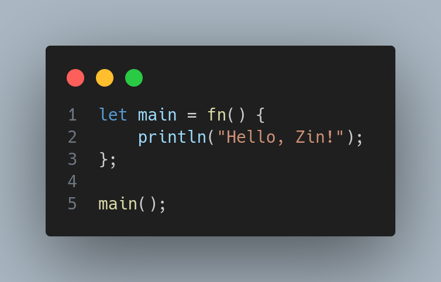

# Zin 🚀

> A cool interpreted language written in OCaml

Zin is a toy programming language that I built to explore the wonderful world of OCaml, lexing, and Abstract Syntax Trees. It's functional, expressive, and surprisingly fun to use! 



## Why Zin? 🤔

I embarked on this journey to learn OCaml from scratch - and I mean *really* from scratch. I didn't even know how to print "Hello, World!" in OCaml when I started this project! 😅

This was my challenge: build something meaningful in an entirely new language. My previous experience with Haskell definitely helped me pick up OCaml quickly, and I have to say - I'm absolutely impressed by how OCaml makes complex logic look so "natural" using Algebraic Data Types (ADTs). It's like the language was designed for building interpreters!

I could have used `ocamllex` for lexical analysis, but where's the fun in that? I wanted to implement everything from scratch to truly understand how interpreters work under the hood. 🔧

## Running Zin 🏃‍♂️
If you're a fellow NixOS user (like me! 😉) or have a Nix + Flakes setup, you're in for a treat:
```bash
# Enter a development shell with all dependencies
nix develop

# Build the Zin executable
nix build

# Run the Zin REPL (or execute a file)
nix run  github:nikhilcodes777/zin
# Or if you have a file: nix run  github:nikhilcodes777/zin -- -i my_program.zin

# Install Zin to your user profile
nix install  github:nikhilcodes777/zin
```
If you prefer the traditional OCaml way, ensure you have Opam and the OCaml toolchain installed.

```bash
# Install dependencies
opam install base cmdliner ppx_deriving dune

# Run Zin
dune exec zin
```

### Pre-built Binaries
Check out the [Release Section](https://github.com/nikhilcodes777/zin/releases/) for directly runnable binaries!

## Features of Zin ✨

-  **Immutable variables by default** (because mutation is the root of all evil)
-  **Shadowing allowed** (define a variable with the same name, and the new one takes precedence in its scope.)
-  **Standard I/O** (talk to the outside world)
-  **Range expressions** `[1..10]` (because typing is hard)
-  **Recursive functions** (inception of functions)
-  **Higher-order functions** (Pass functions as arguments, return functions from functions. Very functional!)
-  **Functional by nature** (side effects are bugs waiting to happen)
-  **Expression-based** (everything evaluates to something)
-  **Statements like `let foo = 9;` evaluate to null** (fair trade)
-  **Dynamically typed** (type errors at runtime, just like JavaScript!)
-  **Multidimensional lists** (Inception of lists)

## Usage 📖

```bash
zin -i FILENAME    # Run a file
zin               # Enter REPL mode
zin --version     # Check version
zin --help        # Print help
```

## Syntax 🎨

```javascript
-- Comments start with double dashes 

-- Factorial: The classic recursion example
let factorial = fn(n) {
  if (n == 1) { 1 }
  else { n * factorial(n - 1) }
};

-- Fibonacci: Because every language needs it
let fib = fn(n) {
  if (n <= 2) { 1 }
  else { fib(n - 1) + fib(n - 2) }
};

-- Need loops? Roll your own! 🛠️
let forloop = fn(counter, max, fx) {
  if (counter <= max) {
    fx(counter);
    forloop(counter + 1, max, fx);
  };
};

let i = 1;
print("Enter the number of fibs you want => ");
let limit = int(readln());
forloop(i, limit, fn(x) {
  println(fib(x));
});

-- While loops? We got you covered (sort of)
let while_state = fn(state, condition_fn, body_fn) {
  if (condition_fn(state)) {
    let next_state = body_fn(state);
    while_state(next_state, condition_fn, body_fn);
  } else {
    return state; -- Return is optional, but clarity is king
  };
};

let initial_counter = 1;
let condition = fn(current_counter) {
  return current_counter <= limit;
};

let body = fn(current_counter) {
  println("Fib(" + str(current_counter) + "): " + str(fib(current_counter)));
  return current_counter + 1;
};

let final_counter_value = while_state(initial_counter, condition, body);
println("Loop finished. Final counter value: " + str(final_counter_value));

-- Range magic ✨
-- [1..10] + [11] returns [1, 2, 3, 4, 5, 6, 7, 8, 9, 10, 11]
-- 0 + [1..10] returns [0, 1, 2, 3, 4, 5, 6, 7, 8, 9, 10]
-- [1..10] + [11..20] returns [1, 2, ..., 20]
-- "foo" + "bar" returns "foobar" (string concatenation)


-- Arrays can be nested (because why stop at one dimension?)
let matrix = [[1, 2, 3], [4, 5, 6], [7, 8, 9]];
let first_row = head(matrix);
let element = head(head(matrix)); -- Gets 1

-- Functions are first-class citizens
let apply_twice = fn(f, x) { f(f(x)) };
let increment = fn(x) { x + 1 };
let result = apply_twice(increment, 5); -- Returns 7
```

## Built-in Functions 🔧

- `len(x)` → Length of string or array
- `print(x)` → Print without newline  
- `println(x)` → Print with newline
- `readln()` → Read string from stdin
- `str(x)` → Convert input to string
- `int(s)` → Parse integer from string (or cry trying)
- `type(x)` → Returns the type of input
- `head(arr)` → First element of array
- `tail(arr)` → Array minus the first element
- `last(arr)` → Last element of array

## Resources I Used 📚

- [Crafting Interpreters](https://craftinginterpreters.com/introduction.html) - The holy grail of interpreter books
- [Learn OCaml in Y Minutes](https://learnxinyminutes.com/ocaml/) - OCaml crash course
- [OCaml Documentation](https://ocaml.org/docs) - When in doubt, RTFM
- [Cmdliner Documentation](https://erratique.ch/software/cmdliner) - For that sweet CLI experience

## License 📄

Zin is released under the MIT License. See the LICENSE file for more details.

---

*Built with ❤️, lots of ☕, and a healthy dose of "how hard could it be?" attitude.*
